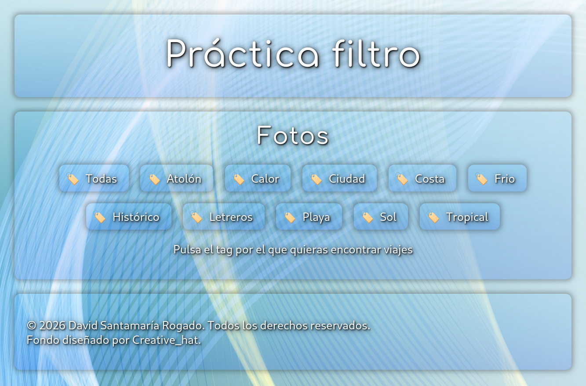

# Práctica de eventos del DOM

## Fases de la práctica

### Array de objetos

El ejercicio parte de un array de objetos que corresponden a una serie de imágenes y presentan la siguiente definición:

```
    {
      imgSrc: 'path/a/la/imagen.jpg',
      pais: 'País de donde es el viaje',
      descripcion: 'Una descripción del viaje.',
      tags: ['etiquetas', 'que', 'categorizan', 'el', 'viaje'],
    },
```

### Botones de etiquetas

La primera parte consiste en recorrer el array de tags contenido en cada uno de los objetos y generar un nuevo array que contenga las etiquetas únicas de todos los viajes.

Este array de etiquetas únicas ha de ser mostrado como una hilera de botones que nos servirá para filtrar los viajes que contengan la etiqueta correspondiente al botón que se pulse.



### Mostrar los viajes con la etiqueta pulsada

La siguiente parte consiste en mostrar los viajes que contienen la etiqueta que se ha pulsado mostrando uno de ellos como principal en primer lugar y ocupando siempre el ancho completo.

Después del viaje principal se mostrará un encabezado que diga 'Viajes relacionados' y posteriormente todas los demás viajes que contienen la etiqueta.


### Colocar como viaje principal aquella que se pulse

La última parte consiste en hacer que al pulsar en alguno de los viajes relacionados, este se coloque como el viaje principal.


## Requisitos
El ejercicio ha de cumplir una serie de condiciones:

- Ha de realizarse en un repositorio Git en una rama distinta a la principal realizando diversos commits en base a según se realiza el ejercicio.
- Usar exclusivamente HTML (utilizando correctamente etiquetas semánticas), CSS (haciendo uso adecuado de selectores) y JavaScript (creando funciones de forma racional).
- Ha de tener un diseño responsive para múltiples dispositivos.
